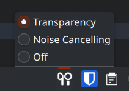

# Pixel Buds Pro Control

This is a KDE applet designed to be used with [pbpctrl](https://github.com/qzed/pbpctrl)
to provide a convenient status bar applet for the Pixel Buds Pro, similar to what you
might get with AirPods on Mac OS.

## Prerequisites

This applet relies on [pbpctrl](https://github.com/qzed/pbpctrl) to function. On arch linux,
it can be installed from the AUR as `pbpctrl`.

## Screenshot

